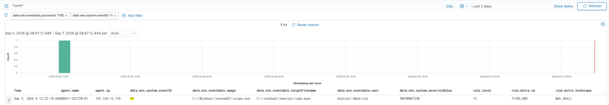
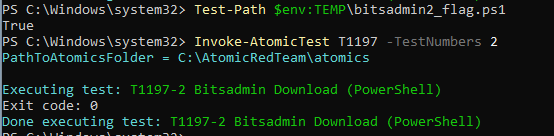
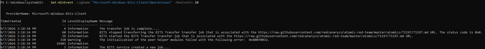
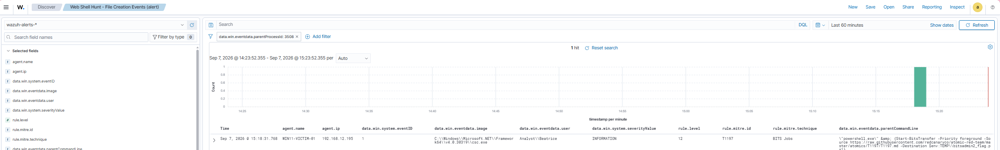
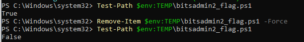
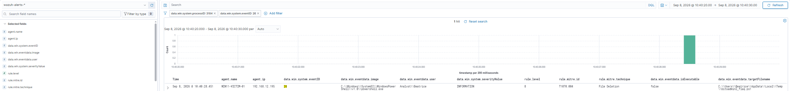
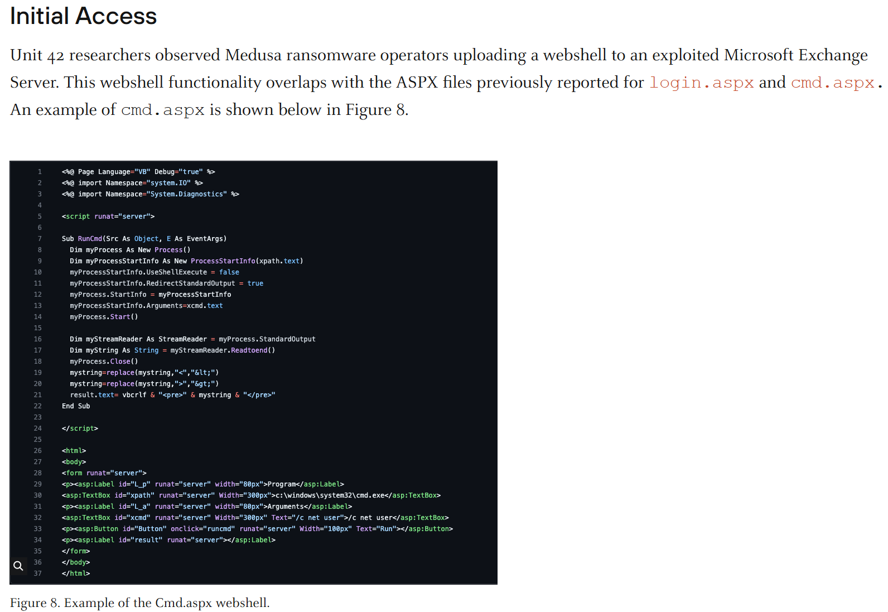

# Threat Hunt Technical Report: Medusa Ransomware (RaaS)

**Author:** Bea Hodson
**Date:** [fill in]
**Lab Environment:** Proxmox home lab — Wazuh SIEM (Docker, Ubuntu VM) + Windows 11 victim host (Sysmon, Olaf Hartong config) + Atomic Red Team
**Primary Source(s):**
- CISA Advisory AA25-071A: https://www.cisa.gov/news-events/cybersecurity-advisories/aa25-071a
- MITRE ATT&CK Group G1051 (Medusa Group): https://attack.mitre.org/groups/G1051/
- Unit 42 (Palo Alto Networks) — Medusa initial access reporting [add full citation/link]

---

## Methodology & Preface

This hunt uses a hypothesis-driven methodology: for each stage of the documented attack chain, a hypothesis is formed *before* consulting incident-specific reporting in detail, based on the threat actor's known tradecraft profile (from MITRE ATT&CK group data and/or prior CTI reporting). The hypothesis is then compared against the specific incident/advisory data, and where lab conditions allow, emulated using Atomic Red Team and hunted for in Wazuh.

Because I control both the emulation (red side) and the detection stack (blue side) in this lab, every hypothesis in this exercise is expected to resolve true. The value isn't in genuine uncertainty of outcome — it's in practicing the analytical discipline of predicting adversary behavior from a threat actor's documented profile before consulting incident-specific reporting. This mirrors the actual cognitive process of professional threat hunting, where hypotheses are generated from CTI and actor knowledge rather than from advance knowledge of the specific intrusion under investigation.

A hypothesis being "true" in this exercise reflects that it was formed with sound reasoning grounded in a credible actor profile — not that a genuine unknown was resolved.

Reconnaissance and Resource Development, while critical to the attack chain, are harder to detect. Therefore, I made the decision to exclude them from the tables. These tactics occur entirely on attacker-controlled infrastructure before the victim compromise, and so they produce no observable events. That said, there are ways to reduce the likelihood of falling victim to Initial Access Brokers' (IABs') exploits, and this will be addressed in the Mitigation and Remediation section to outline preventative controls (credential hygiene, phishing-resistant MFA) rather than detective.

Where a technique could not be reproduced in this lab (due to missing infrastructure — a domain controller, a second host, a vulnerable public-facing application, etc.), third-party incident research (e.g., Unit 42, DFIR Report) is used as a stand-in for direct observation. These findings are clearly marked as externally sourced, both in the table's "Grounded In" column and in a dedicated reference-artifacts appendix, to preserve the distinction between evidence I personally reproduced and evidence I am citing from someone else's published research.

---

## Table 1: Full ATT&CK Matrix — Complete Analytical Record

| Stage | Technique | ID | Hypothesis (Pre-Analysis) | Finding (Post-Analysis) | Grounded In | Atomic Test Available | Emulation Status |
|---|---|---|---|---|---|---|---|
| Initial Access | Exploit Public-Facing Application | T1190 | Medusa targeted public facing web application weaknesses. | Medusa gained access through a Microsoft Exchange Server vulnerability by modifying the ASPX file and uploading a webshell (cmd.aspx). | CISA Advisory, MITRE Group Page, Unit 42 | TBD | Not Emulated — lab lacks a vulnerable public-facing Exchange server |
| Execution | BITS Jobs | T1197 | Having gained a foothold, Medusa delivered additional tools using native Windows utilities, consistent with their LOL strategy. | Medusa was observed using PowerShell to invoke a bitsadmin transfer, downloading a compressed file (baby.zip) containing ConnectWise from a file hosting site (filemail.com). | Unit 42, MITRE Group Page | Y (T1197-2: Bitsadmin Download (PowerShell)) | Emulated — see Detection Engineering for a notable data-visibility limitation discovered during this hunt. |
| Persistence | Web Shell | T1505.003 | Medusa established persistence using a webshell. | Medusa was observed uploading the cmd.aspx web shell to the compromised Exchange server. This provides a persistent backdoor as long as the web shell is present. | Unit 42 | Y (T1505.003-1: Web Shell Written to Disk) | Emulated — the file-drop mechanism of a cmd.aspx web shell was reproduced via Atomic Red Team, independent of the original Exchange exploit vector, which remains Not Emulated. |
| Defense Evasion | Indicator Removal: File Deletion | T1070.004 | Medusa will cover their tracks by removing previously used artifacts to accomplish their objectives. | Medusa deleted the files used in previous stages of the attack to avoid detection. | CISA Advisory | N (no packaged Atomic test; reproduced manually via native deletion, consistent with Medusa's documented low-sophistication cleanup approach) | Emulated — reproduced by deleting the T1197 test artifact (bitsadmin2_flag.ps1) from %TEMP%. See Detection Engineering for a Sysmon event-ID nuance discovered during this hunt. |
| Command and Control | Remote Desktop Software | T1219.002 | Given Medusa's preference for trusted, LOLBin-style tooling over custom malware, they deployed a legitimate RMM tool to gain remote access to the victim host. | Medusa deployed ConnectWise and configured it to connect to attacker-controlled infrastructure rather than the victim organization's own, giving them a legitimate-looking remote access vector. | Unit 42 | N (no Atomic Red Team coverage for T1219.002) | Not Emulated — would require dedicated attacker-controlled infrastructure and a licensed RMM trial; scoped as a candidate for a future, dedicated lab exercise rather than this report. |

---

## Table 2: Confirmed Reproducible Findings

*(Only rows marked `Emulated` in Table 1 go here — self-reproduced evidence only.)*

| Stage | Technique | ID | Figure Ref | Key Observation |
|---|---|---|---|---|
| Persistence | Web Shell | T1505.003 | Figures 1a, 1b | Atomic Red Team (T1505.003-1) wrote cmd.aspx to `C:\inetpub\wwwroot` via xcopy.exe. Sysmon Event ID 11 (FileCreate) captured the event and forwarded it to Wazuh. No existing Wazuh rule matched this event — a custom detection rule (ID 100001) was written to close the gap. See Detection Engineering section below. |
| Execution | BITS Jobs | T1197 | Figures 2a, 2b, 2c | Atomic Red Team (T1197-2) ran `Start-BitsTransfer` via PowerShell to download a file to `$env:TEMP`. Sysmon's Event ID 11 never captured the final filename — BITS downloads via a temporary, randomly-named file and completes with a rename, which Sysmon does not log. Windows' native BITS-Client operational log (`Microsoft-Windows-Bits-Client/Operational`) provided full visibility where Sysmon could not. A custom detection rule (ID 100002) built on process creation (Event ID 1) and `ParentCommandLine` content — rather than file creation — was written to close the gap, and correctly fired after a regex fix (see Detection Engineering). |
| Defense Evasion | Indicator Removal: File Deletion | T1070.004 | Figures 3a, 3b | The T1197 test artifact (bitsadmin2_flag.ps1) was deleted from `%TEMP%`, consistent with CISA's documented Medusa cleanup behavior. Wazuh's default ruleset had a base classification rule for this event but no actual alerting logic (level 0). A custom rule (ID 100003) was written and initially failed to fire — deletion surfaced as Sysmon Event ID 26 (FileDeleteDetected), not 23 (FileDelete) as expected, requiring the rule's `if_sid` reference to be corrected. See Detection Engineering. |

---

## Appendix A: Reproduced Evidence

*(Your own lab work — Atomic Red Team execution, Sysmon events, Wazuh queries/alerts.)*

### Figure 1a: T1505.003 — Atomic Red Team Execution


**Caption:** Atomic Red Team test T1505.003-1 (Web Shell Written to Disk) executed on the Windows 11 victim host, copying cmd.aspx, b.jsp, and tests.jsp into `C:\inetpub\wwwroot` via xcopy.exe.

### Figure 1b: T1505.003 — Web Shell File Creation Detected


**Caption:** Wazuh Discover view showing the custom rule (ID 100001) firing at rule.level 15 against a Sysmon Event ID 11 (FileCreate) for cmd.aspx written to C:\inetpub\wwwroot by xcopy.exe under the Analyst\Beatrice account.

**Narrative:** Atomic Red Team test T1505.003-1 was executed on the Windows 11 victim host, copying cmd.aspx into the IIS default web root. Sysmon captured the file creation as Event ID 11. Initial hunting confirmed the raw event reached Wazuh's `wazuh-archives-*` index but matched no existing detection rule — Wazuh's default Sysmon Event ID 11 ruleset (`0830-sysmon_id_11.xml`) has coverage for Windows Temp, AppData, the Windows root folder, and the Public folder, but no coverage for IIS/web-root paths. A custom rule was written (see Detection Engineering) to close this gap. Re-running the test after deploying the rule confirmed it now correctly classifies at rule.level 15 in `wazuh-alerts-*`.

One notable troubleshooting finding during this process: the Atomic test's file-copy mechanism (robocopy) preserves the *source* file's original timestamp rather than stamping the copy time, meaning `LastWriteTime` on the resulting file is misleading for confirming test freshness. `CreationTime`, or directly querying Sysmon's own `TimeCreated` field, is the reliable signal instead.

Two infrastructure gaps were also identified and resolved in the course of this hunt: (1) the Wazuh agent's `ossec.conf` was never configured with an `<eventchannel>` block for `Microsoft-Windows-Sysmon/Operational`, meaning Sysmon telemetry was never forwarded to the SIEM despite the agent showing Active; and (2) following a full manager rebuild for the live-agent architecture, the `wazuh-archives-*` index and its supporting filebeat configuration (`setup.ilm.enabled`, `archives.enabled`) reset to defaults and had to be reapplied.

### Figure 2a: T1197 — Atomic Red Team Execution


**Caption:** Atomic Red Team test T1197-2 (Bitsadmin Download - PowerShell) executed on the Windows 11 victim host, invoking `Start-BitsTransfer` to download a file to `$env:TEMP\bitsadmin2_flag.ps1`.

### Figure 2b: T1197 — BITS-Client Operational Log


**Caption:** Windows' native `Microsoft-Windows-Bits-Client/Operational` log showing the transfer job started and completed against the true source URL — the data source that provided visibility where Sysmon's FileCreate event did not.

### Figure 2c: T1197 — Custom Rule Detection


**Caption:** Wazuh Discover view showing custom rule 100002 firing at rule.level 12 against the Sysmon Event ID 1 (ProcessCreate) event, matching on `ParentCommandLine` containing both a BITS invocation term and a Temp-directory reference.

**Narrative:** Atomic Red Team test T1197-2 was executed, invoking PowerShell's `Start-BitsTransfer` cmdlet to download a file to the user's Temp directory. `Test-Path` confirmed the target file existed on disk, but extensive hunting across multiple time windows found no Sysmon Event ID 11 (FileCreate) for the final filename. Cross-referencing Sysmon/BITS documentation confirmed the cause: BITS downloads to a randomly-named temporary file (`BITS[random].tmp`) and completes the transfer via a rename operation — Sysmon does not log file renames, only `CreateFile` calls, so the final artifact's creation is invisible to this specific sensor by design, not misconfiguration.

Windows' own native BITS-Client operational log (`Microsoft-Windows-Bits-Client/Operational`) was checked as an alternative data source and provided complete visibility: transfer-started and transfer-complete events, tied to the true source URL, with full fidelity.

Given this Sysmon limitation, detection was deliberately built on **Event ID 1 (ProcessCreate)** and the `ParentCommandLine` field rather than file creation — catching the *invocation* of BITS rather than trying to observe its output on disk. An initial version of the rule failed to fire because the command line captured by Sysmon contained the literal, unexpanded environment variable reference `$env:TEMP`, not the resolved path (`C:\Users\...\AppData\Local\Temp\...`) — a real-world nuance, since attackers commonly use environment variables specifically because they are portable across victim usernames. The rule pattern was corrected to match the variable reference directly. `wazuh-logtest` could not be used to validate this rule during development, since manually-constructed JSON test events cannot recreate the internal message format Wazuh's `eventchannel` log source produces, meaning validation had to be performed against live, re-triggered telemetry instead.

### Figure 3a: T1070.004 — File Deletion Command


**Caption:** The T1197 test artifact (bitsadmin2_flag.ps1) removed from `%TEMP%` via PowerShell's `Remove-Item`, reproducing CISA's documented Medusa cleanup behavior. Not a packaged Atomic Red Team test — manually reproduced, consistent with the low-sophistication, native-tooling cleanup approach CISA describes.

### Figure 3b: T1070.004 — File Deletion Detected


**Caption:** Wazuh Discover view showing custom rule 100003 firing at rule.level 8, correctly identifying the deletion of `bitsadmin2_flag.ps1` from `%TEMP%` as Sysmon Event ID 26 (FileDeleteDetected), attributed to powershell.exe.

**Narrative:** CISA's advisory states that Medusa actors delete their previously used tools and artifacts after completing their objectives. This was reproduced by deleting the T1197 test file from `%TEMP%`. Wazuh's default ruleset was checked for existing coverage first: a base classification rule for Sysmon Event ID 23 (FileDelete) exists (`61651`), but at severity level 0 — meaning the event is categorized but never evaluated for maliciousness, the same "classified but not alerted" pattern found during the T1505.003 hunt.

A custom rule (100003) was written, initially chained under rule 61651 (Event ID 23). It did not fire. Investigation in `wazuh-archives-*` revealed the actual event generated was **Sysmon Event ID 26 (FileDeleteDetected)**, not Event ID 23 (FileDelete) — two distinct Sysmon event types for file deletion, where 23 additionally archives a copy of the deleted file's contents and 26 only logs that a deletion occurred. Olaf Hartong's Sysmon configuration is evidently set to log this deletion path via the lighter-weight Event ID 26 rather than 23. The rule's `if_sid` reference was corrected to `61654` (the equivalent base classification rule for Event ID 26), after which it fired correctly.

---

## Appendix B: Reference Artifacts (External Sources)

*(Third-party research screenshots, used to support a Finding where the technique could not be reproduced in this lab.)*

### Figure R1: Web Shell (cmd.aspx) — Source: Unit 42


**Caption:** Example of the cmd.aspx webshell used by Medusa operators following exploitation of a Microsoft Exchange Server.

**Source citation:** [Full Unit 42 citation/link]

**Relevance:** Supports the Finding for the T1190 (Exploit Public-Facing Application) and T1505.003 (Web Shell) rows in Table 1 — this lab lacks a vulnerable Exchange server, so this technique could not be reproduced directly.

---

## Detection Engineering: Custom Rule (T1505.003)

During the T1505.003 hunt, the cmd.aspx file-creation event was confirmed present in Wazuh's raw archive index (`wazuh-archives-*`) but matched no rule in `wazuh-alerts-*`. Cross-referencing Wazuh's default ruleset (`/var/ossec/ruleset/rules/0830-sysmon_id_11.xml`) confirmed 27 existing Sysmon Event ID 11 rules covering Windows Temp, AppData, the Windows root folder, the Public folder, and the Startup folder — but no coverage for IIS/web-root file drops. A custom rule was written to close this specific gap.

**Rule location:** `/var/ossec/etc/rules/local_rules.xml` (user-defined ruleset directory, chosen over the vendor's `ruleset/rules` directory so the rule survives future Wazuh updates)

**Rule ID:** `100001` (Wazuh reserves IDs 100000+ for user-defined rules, keeping it outside the vendor's reserved range and safe from being overwritten by ruleset updates)

```xml
<group name="sysmon,sysmon_eid11_detections,windows,">

  <rule id="100001" level="15">
    <if_group>sysmon_event_11</if_group>
    <field name="win.eventdata.targetFilename" type="pcre2">(?i)[c-z]:\\\\inetpub\\\\wwwroot\\\\.+\.(aspx|jsp|php|asp)</field>
    <options>no_full_log</options>
    <description>Possible web shell dropped in IIS web root: $(win.eventdata.targetFilename) created by $(win.eventdata.image)</description>
    <mitre>
      <id>T1505.003</id>
    </mitre>
  </rule>

</group>
```

**Design decisions:**
- **Severity level 15 (Wazuh's maximum)** — chosen because a file matching this pattern represents immediate, persistent, remotely-accessible code execution on an internet-facing asset the moment it lands, which is more severe than a generic temp-folder drop (the closest comparable vendor rule, `92213`, sits at 15 for a less specific scenario).
- **Scope kept intentionally broad** — the rule does not restrict by originating process, only by target path and extension. This was a deliberate choice to avoid missing true positives during initial deployment; if alert volume proves excessive in a production environment, the rule can be narrowed to specific processes (e.g., excluding known-legitimate deployment tooling) once real baseline traffic is available for tuning. This lab has no legitimate deployment activity to tune against, so an allow-list approach was not attempted here — noted as a limitation.
- **Note on severity fields:** Sysmon's own `severityValue` field remains "INFORMATION" on the resulting event regardless of this rule — that field reflects Sysmon's static event-type classification, not risk. The elevated `rule.level: 15` is Wazuh's analyst-driven severity assessment, layered on top of the raw telemetry. This distinction — raw event classification vs. detection-engineered severity — is itself a useful thing to understand when reading SIEM output.

---

## Detection Engineering: Custom Rule (T1197)

Unlike T1505.003, this technique could not be reliably detected via file creation telemetry. Extensive hunting confirmed Sysmon does not log the final filename of a BITS-delivered file, because BITS downloads to a temporary staging file and completes via a rename — an operation Sysmon's FileCreate event does not capture. Detection was instead built on the moment of invocation.

**Rule location:** `/var/ossec/etc/rules/local_rules.xml`, in a second rule group scoped to `sysmon_eid1_detections` (kept separate from the T1505.003 FileCreate group, since this rule operates on a different Sysmon event type and group)

**Rule ID:** `100002`

```xml
<group name="sysmon,sysmon_eid1_detections,windows,">
  <rule id="100002" level="12">
    <if_group>sysmon_event1</if_group>
    <field name="win.eventdata.parentCommandLine" type="pcre2">(?i)(Start-BitsTransfer|bitsadmin)</field>
    <field name="win.eventdata.parentCommandLine" type="pcre2">(?i)(AppData\\\\Local\\\\Temp|\$env:TEMP|%TEMP%)</field>
    <options>no_full_log</options>
    <description>Possible malicious BITS transfer to user Temp directory: $(win.eventdata.parentCommandLine)</description>
    <mitre>
      <id>T1197</id>
    </mitre>
  </rule>
</group>
```

**Design decisions:**
- **Detection point moved upstream, from file creation to process creation.** Since the final artifact's creation is invisible to Sysmon by design (see narrative above), a rule built on `TargetFilename` would never reliably fire for this technique. Catching the *invocation* of BITS via `ParentCommandLine` is more robust — it doesn't depend on file-write visibility at all, and fires the moment the command is issued rather than after a transfer completes.
- **Two `<field>` conditions, both required (implicit AND).** A BITS invocation alone is common and legitimate — Windows Update, SCCM, and various software updaters all use it routinely, downloading to system-managed locations. Requiring the command line to *also* reference a user's Temp directory narrows the rule to a genuinely unusual combination: BITS being used to stage a file somewhere a legitimate deployment tool would not.
- **Destination path over source domain.** An earlier design option considered matching against known-malicious source domains, but this was rejected as fragile — attacker infrastructure changes constantly, while writing to a user-writable Temp directory (rather than a system-managed path) is a more durable behavioral signal.
- **Environment variable matching, not just literal paths.** The first version of this rule matched only the literal expanded path (`AppData\Local\Temp`) and failed to fire, because Sysmon captured the command line exactly as typed — `$env:TEMP`, an unresolved variable reference. The pattern was corrected to match the variable syntax directly (`\$env:TEMP`, `%TEMP%`) alongside the expanded path. This is a meaningful real-world consideration: attackers commonly use environment variables specifically because they resolve correctly regardless of the victim's username, making literal-path-only detection logic unreliable against portable attacker scripts.
- **Severity level 12**, one level below the T1505.003 rule's 15 — reasoning being a BITS-to-Temp invocation is a strong staging indicator but, unlike a live web shell already dropped in an internet-facing web root, does not by itself confirm a completed, persistent compromise.

---

## Detection Engineering: Custom Rule (T1070.004)

Wazuh's default ruleset was checked before writing anything new. A base classification rule exists for Sysmon Event ID 23 (FileDelete) — `61651` — but at severity level 0, meaning the event is tagged into the `sysmon_event_23` group but never evaluated for maliciousness. This is the same "classified but not alerted" pattern already found during the T1505.003 hunt.

**Rule location:** `/var/ossec/etc/rules/local_rules.xml`, third rule group, scoped to `sysmon_eid23_detections`

**Rule ID:** `100003`

```xml
<group name="sysmon,sysmon_eid23_detections,windows,">
  <rule id="100003" level="8">
    <if_sid>61654</if_sid>
    <field name="win.eventdata.targetFilename" type="pcre2">(?i)\.(ps1|bat|exe|dat)</field>
    <field name="win.eventdata.targetFilename" type="pcre2">(?i)(AppData\\\\Local\\\\Temp|\$env:TEMP|%TEMP%)</field>
    <options>no_full_log</options>
    <description>Possible malicious file deletion in user Temp directory: $(win.eventdata.targetFilename)</description>
    <mitre>
      <id>T1070.004</id>
    </mitre>
  </rule>
</group>
```

**Design decisions:**
- **`if_sid` chosen deliberately over `if_group`**, unlike the first two rules in this ruleset. Since only one rule exists for this event type at all (no ecosystem of related vendor rules sharing a group tag), chaining directly to the specific rule ID is the more precise and intentional choice.
- **Scoped to the same four extensions and Temp/AppData location logic as rule 100002**, reflecting the same reasoning: a deletion alone is far too common (browsers, installers, and Windows itself delete Temp files constantly) to be a useful signal on its own. Narrowing to script/executable extensions in a user-writable staging location keeps the rule meaningful. `.dat` was included specifically because it is a documented extension threat actors use to disguise payloads as innocuous data files, even though it is neither a script nor a native executable type.
- **Severity level 8 — deliberately lower than both prior rules.** Reasoning: by the time this event fires, the activity it's flagging has already concluded and the artifact is gone — there's comparatively less immediate opportunity for real-time response compared to rule 100002 (BITS invocation), which fires while an attacker may still be actively staging their next step.
- **`if_sid` initially pointed to the wrong base rule.** The rule was first built against `61651` (Event ID 23 / FileDelete) and did not fire. Investigation confirmed the actual event generated on deletion was **Event ID 26 (FileDeleteDetected)**, not 23 — two distinct Sysmon event types, where 23 additionally archives the deleted file's content and 26 only records that a deletion occurred. The Sysmon configuration in use logs this specific deletion path via Event 26. The rule was corrected to chain under `61654`, the base classification rule for Event 26, after which it fired correctly.

---

## Hunt Summary / Findings Summary

[Fill in once the full table is complete.]

---

## Incident Response Summary (PICERL)

**Preparation:**

**Identification:**

**Containment:**

**Eradication:**

**Recovery:**

**Lessons Learned:**

---

## Mitigation & Remediation Strategy

[Include preventative controls for excluded Reconnaissance/Resource Development stages here — credential hygiene, phishing-resistant MFA, dark web/breach monitoring — plus TTP-specific recommendations as the table fills in.]

---

## References

- CISA. (2025, March 12, updated Aug. 18, 2026). #StopRansomware: Medusa Ransomware. AA25-071A. https://www.cisa.gov/news-events/cybersecurity-advisories/aa25-071a
- MITRE ATT&CK. Medusa Group, G1051. https://attack.mitre.org/groups/G1051/
- Unit 42, Palo Alto Networks. [Full citation for the Medusa initial access article]
