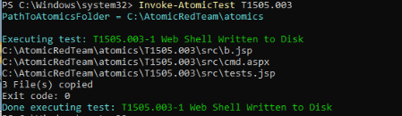

# Threat Hunt Technical Report: Medusa Ransomware (RaaS)

**Author:** Bea Hodson
**Date:** [fill in]
**Lab Environment:** Proxmox home lab — Wazuh SIEM (Docker, Ubuntu VM) + Windows 11 victim host (Sysmon, Olaf Hartong config) + Atomic Red Team
**Primary Source(s):**
- CISA Advisory AA25-071A: https://www.cisa.gov/news-events/cybersecurity-advisories/aa25-071a
- MITRE ATT&CK Group G1051 (Medusa Group): https://attack.mitre.org/groups/G1051/
- Unit 42 (Palo Alto Networks) — Medusa initial access reporting [add full citation/link]

---

## Methodology & Preface

This hunt uses a hypothesis-driven methodology: for each stage of the documented attack chain, a hypothesis is formed *before* consulting incident-specific reporting in detail, based on the threat actor's known tradecraft profile (from MITRE ATT&CK group data and/or prior CTI reporting). The hypothesis is then compared against the specific incident/advisory data, and where lab conditions allow, emulated using Atomic Red Team and hunted for in Wazuh.

Because I control both the emulation (red side) and the detection stack (blue side) in this lab, every hypothesis in this exercise is expected to resolve true. The value isn't in genuine uncertainty of outcome — it's in practicing the analytical discipline of predicting adversary behavior from a threat actor's documented profile before consulting incident-specific reporting. This mirrors the actual cognitive process of professional threat hunting, where hypotheses are generated from CTI and actor knowledge rather than from advance knowledge of the specific intrusion under investigation.

A hypothesis being "true" in this exercise reflects that it was formed with sound reasoning grounded in a credible actor profile — not that a genuine unknown was resolved.

Reconnaissance and Resource Development, while critical to the attack chain, are harder to detect. Therefore, I made the decision to exclude them from the tables. These tactics occur entirely on attacker-controlled infrastructure before the victim compromise, and so they produce no observable events. That said, there are ways to reduce the likelihood of falling victim to Initial Access Brokers' (IABs') exploits, and this will be addressed in the Mitigation and Remediation section to outline preventative controls (credential hygiene, phishing-resistant MFA) rather than detective.

Where a technique could not be reproduced in this lab (due to missing infrastructure — a domain controller, a second host, a vulnerable public-facing application, etc.), third-party incident research (e.g., Unit 42, DFIR Report) is used as a stand-in for direct observation. These findings are clearly marked as externally sourced, both in the table's "Grounded In" column and in a dedicated reference-artifacts appendix, to preserve the distinction between evidence I personally reproduced and evidence I am citing from someone else's published research.

---

## Table 1: Full ATT&CK Matrix — Complete Analytical Record

| Stage | Technique | ID | Hypothesis (Pre-Analysis) | Finding (Post-Analysis) | Grounded In | Atomic Test Available | Emulation Status |
|---|---|---|---|---|---|---|---|
| Initial Access | Exploit Public-Facing Application | T1190 | Medusa targeted public facing web application weaknesses. | Medusa gained access through a Microsoft Exchange Server vulnerability by modifying the ASPX file and uploading a webshell (cmd.aspx). | CISA Advisory, MITRE Group Page, Unit 42 | TBD | Not Emulated — lab lacks a vulnerable public-facing Exchange server |
| Persistence | Web Shell | T1505.003 | Medusa established persistence using a webshell. | Medusa was observed uploading the cmd.aspx web shell to the compromised Exchange server. This provides a persistent backdoor as long as the web shell is present. | Unit 42 | Y (T1505.003-1: Web Shell Written to Disk) | Emulated — the file-drop mechanism of a cmd.aspx web shell was reproduced via Atomic Red Team, independent of the original Exchange exploit vector, which remains Not Emulated. |
| Execution | BITS Jobs | T1197 | | | | | |
| Command and Control | Remote Desktop Software | T1219.002 | | | | | |

---

## Table 2: Confirmed Reproducible Findings

*(Only rows marked `Emulated` in Table 1 go here — self-reproduced evidence only.)*

| Stage | Technique | ID | Figure Ref | Key Observation |
|---|---|---|---|---|
| Persistence | Web Shell | T1505.003 | Figures 1a, 1b | Atomic Red Team (T1505.003-1) wrote cmd.aspx to `C:\inetpub\wwwroot` via xcopy.exe. Sysmon Event ID 11 (FileCreate) captured the event and forwarded it to Wazuh. No existing Wazuh rule matched this event — a custom detection rule (ID 100001) was written to close the gap. See Detection Engineering section below. |

---

## Appendix A: Reproduced Evidence

*(Your own lab work — Atomic Red Team execution, Sysmon events, Wazuh queries/alerts.)*

### Figure 1a: T1505.003 — Atomic Red Team Execution


**Caption:** Atomic Red Team test T1505.003-1 (Web Shell Written to Disk) executed on the Windows 11 victim host, copying cmd.aspx, b.jsp, and tests.jsp into `C:\inetpub\wwwroot` via xcopy.exe.

### Figure 1b: T1505.003 — Web Shell File Creation Detected
*[Screenshot: Wazuh Discover, wazuh-alerts-* index, showing the cmd.aspx event with columns agent.name, agent.ip, data.win.system.eventID, data.win.eventdata.image, data.win.eventdata.targetFilename, data.win.eventdata.user, data.win.system.severityValue, rule.level, rule.mitre.id, rule.mitre.technique]

**Caption:** Wazuh Discover view showing the custom rule (ID 100001) firing at rule.level 15 against a Sysmon Event ID 11 (FileCreate) for cmd.aspx written to C:\inetpub\wwwroot by xcopy.exe under the Analyst\Beatrice account.

**Narrative:** Atomic Red Team test T1505.003-1 was executed on the Windows 11 victim host, copying cmd.aspx into the IIS default web root. Sysmon captured the file creation as Event ID 11. Initial hunting confirmed the raw event reached Wazuh's `wazuh-archives-*` index but matched no existing detection rule — Wazuh's default Sysmon Event ID 11 ruleset (`0830-sysmon_id_11.xml`) has coverage for Windows Temp, AppData, the Windows root folder, and the Public folder, but no coverage for IIS/web-root paths. A custom rule was written (see Detection Engineering) to close this gap. Re-running the test after deploying the rule confirmed it now correctly classifies at rule.level 15 in `wazuh-alerts-*`.

One notable troubleshooting finding during this process: the Atomic test's file-copy mechanism (robocopy) preserves the *source* file's original timestamp rather than stamping the copy time, meaning `LastWriteTime` on the resulting file is misleading for confirming test freshness. `CreationTime`, or directly querying Sysmon's own `TimeCreated` field, is the reliable signal instead.

Two infrastructure gaps were also identified and resolved in the course of this hunt: (1) the Wazuh agent's `ossec.conf` was never configured with an `<eventchannel>` block for `Microsoft-Windows-Sysmon/Operational`, meaning Sysmon telemetry was never forwarded to the SIEM despite the agent showing Active; and (2) following a full manager rebuild for the live-agent architecture, the `wazuh-archives-*` index and its supporting filebeat configuration (`setup.ilm.enabled`, `archives.enabled`) reset to defaults and had to be reapplied.

---

## Appendix B: Reference Artifacts (External Sources)

*(Third-party research screenshots, used to support a Finding where the technique could not be reproduced in this lab.)*

### Figure R1: Web Shell (cmd.aspx) — Source: Unit 42
*[Screenshot]*

**Caption:** Example of the cmd.aspx webshell used by Medusa operators following exploitation of a Microsoft Exchange Server.

**Source citation:** [Full Unit 42 citation/link]

**Relevance:** Supports the Finding for the T1190 (Exploit Public-Facing Application) and T1505.003 (Web Shell) rows in Table 1 — this lab lacks a vulnerable Exchange server, so this technique could not be reproduced directly.

---

## Detection Engineering: Custom Rule (T1505.003)

During the T1505.003 hunt, the cmd.aspx file-creation event was confirmed present in Wazuh's raw archive index (`wazuh-archives-*`) but matched no rule in `wazuh-alerts-*`. Cross-referencing Wazuh's default ruleset (`/var/ossec/ruleset/rules/0830-sysmon_id_11.xml`) confirmed 27 existing Sysmon Event ID 11 rules covering Windows Temp, AppData, the Windows root folder, the Public folder, and the Startup folder — but no coverage for IIS/web-root file drops. A custom rule was written to close this specific gap.

**Rule location:** `/var/ossec/etc/rules/local_rules.xml` (user-defined ruleset directory, chosen over the vendor's `ruleset/rules` directory so the rule survives future Wazuh updates)

**Rule ID:** `100001` (Wazuh reserves IDs 100000+ for user-defined rules, keeping it outside the vendor's reserved range and safe from being overwritten by ruleset updates)

```xml
<group name="sysmon,sysmon_eid11_detections,windows,">

  <rule id="100001" level="15">
    <if_group>sysmon_event_11</if_group>
    <field name="win.eventdata.targetFilename" type="pcre2">(?i)[c-z]:\\\\inetpub\\\\wwwroot\\\\.+\.(aspx|jsp|php|asp)</field>
    <options>no_full_log</options>
    <description>Possible web shell dropped in IIS web root: $(win.eventdata.targetFilename) created by $(win.eventdata.image)</description>
    <mitre>
      <id>T1505.003</id>
    </mitre>
  </rule>

</group>
```

**Design decisions:**
- **Severity level 15 (Wazuh's maximum)** — chosen because a file matching this pattern represents immediate, persistent, remotely-accessible code execution on an internet-facing asset the moment it lands, which is more severe than a generic temp-folder drop (the closest comparable vendor rule, `92213`, sits at 15 for a less specific scenario).
- **Scope kept intentionally broad** — the rule does not restrict by originating process, only by target path and extension. This was a deliberate choice to avoid missing true positives during initial deployment; if alert volume proves excessive in a production environment, the rule can be narrowed to specific processes (e.g., excluding known-legitimate deployment tooling) once real baseline traffic is available for tuning. This lab has no legitimate deployment activity to tune against, so an allow-list approach was not attempted here — noted as a limitation.
- **Note on severity fields:** Sysmon's own `severityValue` field remains "INFORMATION" on the resulting event regardless of this rule — that field reflects Sysmon's static event-type classification, not risk. The elevated `rule.level: 15` is Wazuh's analyst-driven severity assessment, layered on top of the raw telemetry. This distinction — raw event classification vs. detection-engineered severity — is itself a useful thing to understand when reading SIEM output.

---

## Hunt Summary / Findings Summary

[Fill in once the full table is complete.]

---

## Incident Response Summary (PICERL)

**Preparation:**

**Identification:**

**Containment:**

**Eradication:**

**Recovery:**

**Lessons Learned:**

---

## Mitigation & Remediation Strategy

[Include preventative controls for excluded Reconnaissance/Resource Development stages here — credential hygiene, phishing-resistant MFA, dark web/breach monitoring — plus TTP-specific recommendations as the table fills in.]

---

## References

- CISA. (2025, March 12, updated Aug. 18, 2026). #StopRansomware: Medusa Ransomware. AA25-071A. https://www.cisa.gov/news-events/cybersecurity-advisories/aa25-071a
- MITRE ATT&CK. Medusa Group, G1051. https://attack.mitre.org/groups/G1051/
- Unit 42, Palo Alto Networks. [Full citation for the Medusa initial access article]
